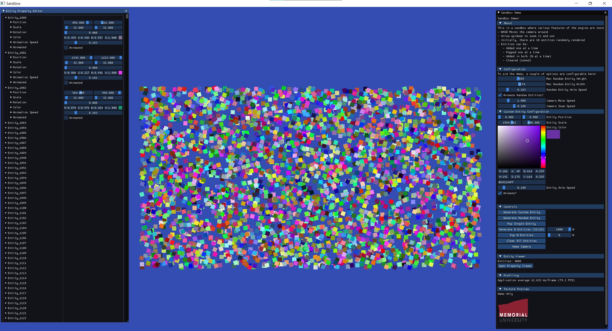
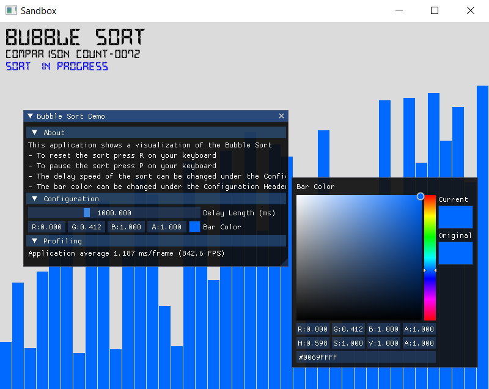
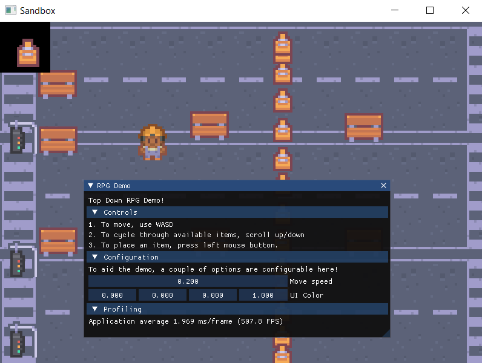
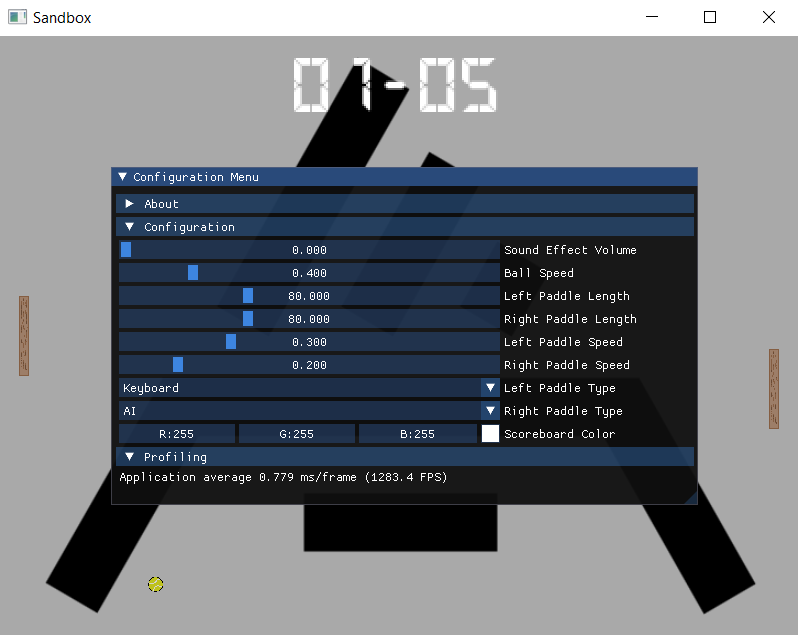

# Aquarius
A 2D game engine developed by Colton Smith, Daniel Burke, & Liam Warren for the Junior Software Design Project 
(ECE 5010).

## Additional Required Software
- CMake Version 3.10 ([Download](https://cmake.org/download/))

**The below commands and the sample application works for Windows, MAC, and Linux but not Windows
Subsystem for Linux (WSL)**

**For ease of building and running the sample Aquarius applications, scripts were developed to automate the building and 
running. Please see the below instructions based on your operating system.**

## Building and Running Sample Aquarius Applications on Mac & Linux
1. Navigate in a command-line interface to the project folder
2. In your command-line execute the following command `sh build-run-sample-app.sh`
3. If a window opens, you have successfully built and run a sample Aquarius application!

## Building and Running Sample Aquarius Applications on Windows
1. Navigate in a command-line interface to the project folder
2. In your command-line interface execute the following command `build-run-sample-app.bat`
3. If a window opens, you have successfully built and run a sample Aquarius application!

## Sandbox Demo Application
To demonstrate the features of the engine, four demo applications were developed. Using a layering system, one executable 
was developed containing all for demos, where page-up / page-down can be used to cycle between the demos. The code for each layer of the demo is in `Sandbox`. 

### Entity Viewer

### Bubblesort Visualizer

### 2D Construction RPG

### Pong Clone
